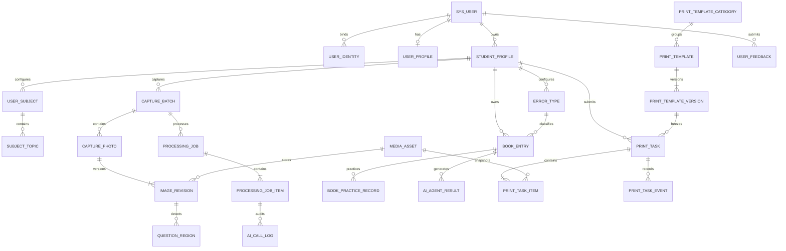

# 拾星错题本：完整数据库实体模型

更新日期：2026-10-10。

| 版本 | 日期 | 变更 |
|---|---|---|
| 1.22.0实现补充 | 2026-10-10 | 新增持久请求回执、管理审计，补充上传临时对象与草稿来源版本字段 |

业务模型已按本文实现为JPA实体；新增服务端接口、状态校验和队列消费者见SERVER-IMPLEMENTATION.md。以下历史“目标／新增”描述用于说明来源，不代表已部署生产。

本文结合当前小程序 UI、原模型和 `yycuotiku-server` 实体／服务代码整理。它是完整的目标模型与现状对照，不代表新增表或字段已部署；小程序当前仍以本地 Demo 数据为主。后端实体、腾讯云调用和 COS 链路标记为“已有”，新增业务明确标记为“新增”或“扩展”。

## 1. 范围与设计原则

- 一个账号配置多个学生，切换学生查看各自错题；每个学生只属于一个账号。不建立共同家长、跨账号共享、邀请或监护关系实体，今后也不扩展这类功能。
- 我的页面显示账号会员名／会员号。手机号、密码、图形验证码用于绑定已有会员；会员不是学生。微信身份与会员账号关联，不能根据客户端填写的会员号直接建立绑定。
- 配置科目、科目下的主题和错误类型；本目标模型按学生隔离分类。当前配置 Demo 为账号本地共享数据，实现后台时需要补齐学生作用域。错误类型允许自定义，不再限制为四个中文选项。
- 图片存腾讯云 COS（开发环境可用本地存储），关系数据库保存元数据、对象定位、来源和引用。保留腾讯云 AI 调用日志、结果、处理版本与任务关系。
- 所有选题入口进入通用“选择模板并打印”页。点击打印才创建正式任务，题图、分类和模板均冻结为快照。
- 不为首页、错题集容器、已取消玩具箱、已移除学习笔记／设置入口新增业务表。使用帮助与关于信息首期可作为静态内容；意见反馈单独建表。

## 2. 字段与类型约定

本文统一使用 snake_case 逻辑字段名；已有 Java 字段在“来源”列标出，实际数据库列名以 JPA 命名策略和数据库结构核对为准。现有 Long 主键保持 BIGINT，已有错题主键保持 VARCHAR(36)；新增业务主键推荐 UUID VARCHAR(36)，接口中所有 ID 按字符串传输。

时间采用 UTC 的 DATETIME(3)／Instant，界面按 Asia/Shanghai 显示。DATE 仅用于会员到期日。每个表的审计字段在各自表格列出，不默认隐藏继承字段。JSON 是目标逻辑类型，现有 resultJson 等 TEXT 字段不因此被描述为已完成 JSON 类型迁移。

新增私有业务以 user_id + student_id 校验归属，关联父实体时仍必须验证同账号同学生。系统模板和公共预览资产不归属学生。FK 表示目标外键关系，不代表现有 JPA 已创建物理外键。“可空”包括历史兼容场景；完成迁移后才能收紧约束。

来源：已有 = 当前实体字段；扩展 = 向已有实体增加字段；新增 = 新实体字段。未注明默认值的必填字段由服务端赋值，不采用空字符串伪装有效数据。

## 3. 账号、微信身份、学生与分类实体
### 1. sys_user — 会员账号

**状态：**已有／按需扩展。

**作用：**保存现有手机号会员账号、登录凭据、权限与会员有效期。微信绑定成功后我的页面显示该账号会员号和会员名。

| 字段 | 类型 | 必填／默认 | 字段含义与关系 | 来源 |
|---|---|---|---|---|
| id | BIGINT | 必填 | 实体主键；Long 为自增，String 为业务 UUID | 已有：id |
| phone | VARCHAR(20) | 必填 | 登录手机号；日志／心跳中为历史账号快照 | 已有：phone |
| member_no | VARCHAR(64) | 可空 | 会员号，供我的页面显示；现有索引不是唯一约束 | 已有：memberNo |
| member_expire_at | DATE | 可空 | 会员权益到期日期，沿用现有会员有效性规则 | 已有：memberExpireAt |
| password | VARCHAR(255) | 必填 | 密码哈希；保留现有字段名，不存明文密码 | 已有：password |
| role | VARCHAR(16) | 必填；默认 USER | 账号权限 USER / ADMIN，不是学生角色 | 已有：role |
| ai_enabled | BOOLEAN | 必填；默认 false | 是否允许调用 AI，默认 false；与会员有效性分别校验 | 已有：aiEnabled |
| enabled | BOOLEAN | 必填；默认 true | 是否启用 | 已有：enabled |
| cancelled | BOOLEAN | 必填；默认 false | 账号注销标记，默认 false | 已有：cancelled |
| session_jti | VARCHAR(64) | 可空 | 当前访问会话标识 | 已有：sessionJti |
| refresh_jti | VARCHAR(64) | 可空 | 当前刷新令牌标识 | 已有：refreshJti |
| taxonomy_v2_activated_at | DATETIME(3) | 可空 | 分类 V2 激活时间，兼容旧客户端 | 已有：taxonomyV2ActivatedAt |
| prev_session_jti | VARCHAR(64) | 可空 | 上一访问会话标识，令牌轮换宽限期使用 | 已有：prevSessionJti |
| prev_refresh_jti | VARCHAR(64) | 可空 | 上一刷新令牌标识 | 已有：prevRefreshJti |
| rotate_reason | VARCHAR(8) | 可空 | 会话轮换原因 | 已有：rotateReason |
| rotated_at | DATETIME(3) | 可空 | 上一次会话轮换时间 | 已有：rotatedAt |
| client_label | VARCHAR(64) | 可空 | 最近登录客户端标识 | 已有：clientLabel |
| last_login_at | DATETIME(3) | 可空 | 最近登录时间 | 已有：lastLoginAt |
| created_at | DATETIME(3) | 必填 | 创建时间，服务端 UTC | 已有：createdAt |
| updated_at | DATETIME(3) | 必填 | 最近更新时间，服务端 UTC | 已有：updatedAt |
| member_name | VARCHAR(64) | 可空；绑定后必填 | 会员显示名，现有 User 没有该字段，需要补充；不能从学生昵称推断 | 扩展 |

**约束与说明：**phone 现有唯一；member_no 现有仅普通索引，如要求会员号全局唯一，先清理重复再增唯一约束。微信未绑定身份不强行创建带虚假手机号的 sys_user。权限 ai_enabled 不自动由会员号非空推断。

### 2. user_identity — 微信登录身份

**状态：**新增。

**作用：**记录微信小程序身份以及与已有会员账号的绑定。一条身份在绑定前也可存在，正式学生业务要求有效会员账号。

| 字段 | 类型 | 必填／默认 | 字段含义与关系 | 来源 |
|---|---|---|---|---|
| id | VARCHAR(36) | 必填，PK | 微信身份主键 | 新增 |
| user_id | BIGINT | 可空，绑定后必填 | 关联 sys_user.id；一条身份最多绑定一个会员账号 | 新增 |
| provider | VARCHAR(32) | 必填 | WECHAT_MINIAPP | 新增 |
| app_id | VARCHAR(64) | 必填 | 微信小程序 AppID | 新增 |
| openid | VARCHAR(128) | 必填 | 该 AppID 下的微信用户标识，仅由后端 code 换取 | 新增 |
| unionid | VARCHAR(128) | 可空 | 微信开放平台联合标识，不能作为首次登录必填 | 新增 |
| status | VARCHAR(16) | 必填；UNBOUND | UNBOUND / BOUND / DISABLED | 新增 |
| bound_at | DATETIME(3) | 可空 | 会员绑定成功时间 | 新增 |
| last_login_at | DATETIME(3) | 可空 | 最近微信登录时间 | 新增 |
| created_at | DATETIME(3) | 必填 | 创建时间 | 新增 |
| updated_at | DATETIME(3) | 必填 | 更新时间 | 新增 |

**约束与说明：**UNIQUE(provider,app_id,openid)。unionid 可空且不能未经策略直接合并账号。session_key、access token 和密码不写入身份表。绑定必须验证图形验证码、手机号密码及身份会话；跨已绑定账号的变更单独处理，不静默覆盖。

### 3. user_profile — 账号展示档案

**状态：**新增。

**作用：**保存微信／账号展示资料和最近使用学生；与会员名、学生档案分开。

| 字段 | 类型 | 必填／默认 | 字段含义与关系 | 来源 |
|---|---|---|---|---|
| user_id | BIGINT | 必填，PK/FK | 关联 sys_user.id，一账号一份档案 | 新增 |
| nickname | VARCHAR(64) | 可空 | 用户主动填写的账号昵称 | 新增 |
| avatar_asset_id | VARCHAR(36) | 可空，FK | 账号头像，关联 media_asset.id，不归属学生 | 新增 |
| last_student_id | VARCHAR(36) | 可空，FK | 最近使用学生，关联 student_profile.id | 新增 |
| created_at | DATETIME(3) | 必填 | 创建时间 | 新增 |
| updated_at | DATETIME(3) | 必填 | 更新时间 | 新增 |

**约束与说明：**last_student_id 必须属于本账号，不能替代接口显式 student_id。微信登录不保证返回昵称头像，不依赖自动获取。

### 4. student_profile — 学生档案

**状态：**新增。

**作用：**一个会员账号配置多个孩子，保存昵称、年级、学期和排序，作为学生数据隔离根节点。

| 字段 | 类型 | 必填／默认 | 字段含义与关系 | 来源 |
|---|---|---|---|---|
| id | VARCHAR(36) | 必填，PK | 学生主键 | 新增 |
| user_id | BIGINT | 必填，FK | 唯一所属账号，关联 sys_user.id | 新增 |
| nickname | VARCHAR(64) | 必填 | 孩子姓名或昵称，可重复 | 新增 |
| avatar_asset_id | VARCHAR(36) | 可空，FK | 学生头像资产 | 新增 |
| grade | SMALLINT | 必填 | 当前年级：1～6 小学，7～9 初中，10～12 高中 | 新增 |
| term | SMALLINT | 必填；1 | 1 上学期／2 下学期 | 新增 |
| status | VARCHAR(16) | 必填；ACTIVE | ACTIVE / ARCHIVED | 新增 |
| sort_order | INT | 必填；0 | 学生卡片显示顺序 | 新增 |
| default_template_id | VARCHAR(36) | 可空，FK | 可选模板偏好，不要求当前 UI 提供配置入口 | 新增 |
| created_at | DATETIME(3) | 必填 | 创建时间 | 新增 |
| updated_at | DATETIME(3) | 必填 | 更新时间 | 新增 |
| deleted_at | DATETIME(3) | 可空 | 逻辑删除时间 | 新增 |

**约束与说明：**不增加家长关系表。修改当前年级不重写历史错题年级；归档后禁止新增业务，历史不级联删除。

### 5. user_subject — 学生科目

**状态：**已有／按需扩展。

**作用：**保存配置科目页面的可排序科目，一科目包含多个主题。

| 字段 | 类型 | 必填／默认 | 字段含义与关系 | 来源 |
|---|---|---|---|---|
| id | BIGINT | 必填 | 实体主键；Long 为自增，String 为业务 UUID | 已有：id |
| user_id | BIGINT | 必填 | 所属会员账号，关联 sys_user.id | 已有：userId |
| name | VARCHAR(30) | 必填 | 显示名称 | 已有：name |
| normalized_name | VARCHAR(30) | 必填 | 规范化名称，用于同作用域去重 | 已有：normalizedName |
| system_key | VARCHAR(16) | 可空 | 预置科目的稳定标识，自定义科目可空 | 已有：systemKey |
| sort_order | INT | 必填 | 显示顺序，默认 0 | 已有：sortOrder |
| status | VARCHAR(10) | 必填；默认 STATUS_ACTIVE | 分类状态，ACTIVE 等值遵循现有服务规则 | 已有：status |
| revision | INT | 必填；默认 0 | 分类修订号，更新冲突检测 | 已有：revision |
| created_at | DATETIME(3) | 必填 | 创建时间，服务端 UTC | 已有：createdAt |
| updated_at | DATETIME(3) | 必填 | 最近更新时间，服务端 UTC | 已有：updatedAt |
| student_id | VARCHAR(36) | 迁移后必填，FK | 所属学生，关联 student_profile.id | 扩展 |
| deleted_at | DATETIME(3) | 可空 | 逻辑删除时间 | 扩展 |

**约束与说明：**目标唯一键为(student_id,normalized_name)。停用／删除只影响新分类选择，不破坏历史错题引用。规范化规则复用 NameNormalizer。

### 6. subject_topic — 科目主题

**状态：**已有／按需扩展。

**作用：**保存点击某科目后主题设置页的主题列表。

| 字段 | 类型 | 必填／默认 | 字段含义与关系 | 来源 |
|---|---|---|---|---|
| id | BIGINT | 必填 | 实体主键；Long 为自增，String 为业务 UUID | 已有：id |
| user_id | BIGINT | 必填 | 所属会员账号，关联 sys_user.id | 已有：userId |
| subject_id | BIGINT | 必填 | 所属科目，关联 user_subject.id | 已有：subjectId |
| name | VARCHAR(30) | 必填 | 显示名称 | 已有：name |
| normalized_name | VARCHAR(30) | 必填 | 规范化名称，用于同作用域去重 | 已有：normalizedName |
| sort_order | INT | 必填 | 显示顺序，默认 0 | 已有：sortOrder |
| status | VARCHAR(10) | 必填；默认 STATUS_ACTIVE | 分类状态，ACTIVE 等值遵循现有服务规则 | 已有：status |
| revision | INT | 必填；默认 0 | 分类修订号，更新冲突检测 | 已有：revision |
| created_at | DATETIME(3) | 必填 | 创建时间，服务端 UTC | 已有：createdAt |
| updated_at | DATETIME(3) | 必填 | 最近更新时间，服务端 UTC | 已有：updatedAt |
| student_id | VARCHAR(36) | 迁移后必填，FK | 与科目所属学生一致 | 扩展 |
| deleted_at | DATETIME(3) | 可空 | 逻辑删除时间 | 扩展 |

**约束与说明：**UNIQUE(student_id,subject_id,normalized_name)。主题必须归属选定科目；不能跨学生引用。

### 7. user_taxonomy_pref — 分类选择偏好

**状态：**已有／按需扩展。

**作用：**复用现有默认科目／主题偏好；学生切换后独立保存。

| 字段 | 类型 | 必填／默认 | 字段含义与关系 | 来源 |
|---|---|---|---|---|
| user_id | BIGINT | 必填 | 所属会员账号，关联 sys_user.id | 已有：userId |
| default_subject_id | BIGINT | 可空 | 默认科目，关联 user_subject.id | 已有：defaultSubjectId |
| default_topic_id | BIGINT | 可空 | 默认主题，关联 subject_topic.id | 已有：defaultTopicId |
| updated_at | DATETIME(3) | 必填 | 最近更新时间，服务端 UTC | 已有：updatedAt |
| student_id | VARCHAR(36) | 迁移后必填，FK | 偏好所属学生 | 扩展 |

**约束与说明：**现有 PK 为 user_id，只能保存一份偏好。多学生目标改为复合主键(user_id,student_id)，或另增 id 并建立唯一键，不能只加 student_id 而保留原主键语义。

### 8. error_type — 学生错误类型

**状态：**新增。

**作用：**保存配置错误类型页的自定义分类，支持错题保存、筛选和随机组卷。

| 字段 | 类型 | 必填／默认 | 字段含义与关系 | 来源 |
|---|---|---|---|---|
| id | VARCHAR(36) | 必填，PK | 错误类型主键 | 新增 |
| user_id | BIGINT | 必填，FK | 所属账号 | 新增 |
| student_id | VARCHAR(36) | 必填，FK | 所属学生 | 新增 |
| code | VARCHAR(64) | 必填 | 稳定机器码，自定义类型由服务端生成 | 新增 |
| name | VARCHAR(64) | 必填 | 显示名称，例如计算错误 | 新增 |
| normalized_name | VARCHAR(64) | 必填 | 规范化名称，用于去重 | 新增 |
| draw_group_code | VARCHAR(16) | 必填；OTHER | 兼容抽题大类 CARELESS / UNFAMILIAR / CONCEPT / OTHER | 新增 |
| sort_order | INT | 必填；0 | 显示顺序 | 新增 |
| status | VARCHAR(16) | 必填；ACTIVE | ACTIVE / ARCHIVED | 新增 |
| revision | INT | 必填；0 | 更新修订号 | 新增 |
| created_at | DATETIME(3) | 必填 | 创建时间 | 新增 |
| updated_at | DATETIME(3) | 必填 | 更新时间 | 新增 |
| deleted_at | DATETIME(3) | 可空 | 逻辑删除时间 | 新增 |

**约束与说明：**UNIQUE(student_id,code)、UNIQUE(student_id,normalized_name)。新随机组卷按 error_type_id 分桶；draw_group_code 只用于兼容旧四类接口，不能通过中文字符串推断。

## 4. 对象存储、采集与图片处理实体

### 9. media_asset — 媒体资产

**状态：**新增。

**作用：**统一登记 COS／本地文件，保存原图、处理图、题图、缩略图、PDF、模板 SVG 和旧 ZIP 对象。

| 字段 | 类型 | 必填／默认 | 字段含义与关系 | 来源 |
|---|---|---|---|---|
| id | VARCHAR(36) | 必填，PK | 资产主键 | 新增 |
| user_id | BIGINT | 可空，FK | 私有资产所属账号；系统模板资产可空 | 新增 |
| student_id | VARCHAR(36) | 可空，FK | 学生业务资产必填；账号头像或公共资产可空 | 新增 |
| storage_provider | VARCHAR(16) | 必填 | COS / LOCAL | 新增 |
| bucket | VARCHAR(128) | COS 必填 | 实际 COS 桶名 | 新增 |
| region | VARCHAR(64) | COS 必填 | COS 地域 | 新增 |
| object_key | VARCHAR(512) | 必填 | 长期对象键，不存带有效期签名 URL | 新增 |
| object_version_id | VARCHAR(256) | 可空 | 启用 COS 版本控制时的版本标识 | 新增 |
| mime_type | VARCHAR(128) | 必填 | 真实对象类型；ZIP 为 application/zip | 新增 |
| format | VARCHAR(16) | 可空 | png / jpeg / pdf / svg / zip 等 | 新增 |
| width | INT | 图像必填，其余可空 | 像素宽度 | 新增 |
| height | INT | 图像必填，其余可空 | 像素高度 | 新增 |
| size_bytes | BIGINT | 上传校验后必填 | 实际对象字节数，不是 Base64 字符串长度 | 新增 |
| checksum_sha256 | CHAR(64) | 上传校验后必填 | 服务端确认的内容摘要 | 新增 |
| etag | VARCHAR(128) | 可空 | COS 返回 ETag，不作为所有上传方式的 SHA-256 | 新增 |
| purpose | VARCHAR(32) | 必填 | ORIGINAL / PROCESSED / CROP / THUMBNAIL / PDF / TEMPLATE_PREVIEW / LEGACY_PACKAGE / AVATAR | 新增 |
| status | VARCHAR(24) | 必填；PENDING_UPLOAD | PENDING_UPLOAD / AVAILABLE / FAILED / DELETE_PENDING / DELETED | 新增 |
| expires_at | DATETIME(3) | 可空 | 未引用临时资产清理候选时间，不是立即删除指令 | 新增 |
| created_at | DATETIME(3) | 必填 | 创建时间 | 新增 |
| updated_at | DATETIME(3) | 必填 | 更新时间 | 新增 |
| deleted_at | DATETIME(3) | 可空 | 确认对象删除时间 | 新增 |

**约束与说明：**COS 对象唯一键(storage_provider,bucket,object_key,object_version_id)需处理 NULL 唯一语义；可用非空标准化版本键。LOCAL 由服务端限制根目录。公开预览与私有题图分开授权。

### 10. asset_upload_session — 资产上传会话

**状态：**新增。

**作用：**控制小程序直接上传或后端代理上传，避免把仅声明上传的对象当作可用照片。

| 字段 | 类型 | 必填／默认 | 字段含义与关系 | 来源 |
|---|---|---|---|---|
| id | VARCHAR(36) | 必填，PK | 上传会话主键 | 新增 |
| asset_id | VARCHAR(36) | 必填，FK | 待上传资产 | 新增 |
| user_id | BIGINT | 必填，FK | 上传账号 | 新增 |
| student_id | VARCHAR(36) | 可空，FK | 业务资产所属学生 | 新增 |
| client_request_id | VARCHAR(64) | 必填 | 客户端幂等键 | 新增 |
| expected_size_bytes | BIGINT | 必填 | 允许上传的目标大小 | 新增 |
| expected_mime_type | VARCHAR(128) | 必填 | 声明类型，完成时仍要检查内容 | 新增 |
| expected_checksum | CHAR(64) | 可空 | 客户端声明摘要，仅用于与实际结果核对 | 新增 |
| status | VARCHAR(16) | 必填；ISSUED | ISSUED / COMPLETED / FAILED / EXPIRED | 新增 |
| expires_at | DATETIME(3) | 必填 | 凭证／会话到期时间 | 新增 |
| completed_at | DATETIME(3) | 可空 | 完成对象 HEAD／内容校验的时间 | 新增 |
| created_at | DATETIME(3) | 必填 | 创建时间 | 新增 |
| updated_at | DATETIME(3) | 必填 | 更新时间 | 新增 |

**约束与说明：**UNIQUE(user_id,client_request_id)。不保存永久 SecretKey 或临时凭证明文；凭证短期、限对象与动作。只有完成校验才把资产设 AVAILABLE。

### 11. capture_batch — 采集批次

**状态：**新增。

**作用：**单张和多页拍照／导入的工作区，打开拍摄页时冻结学生归属。

| 字段 | 类型 | 必填／默认 | 字段含义与关系 | 来源 |
|---|---|---|---|---|
| id | VARCHAR(36) | 必填，PK | 批次主键 | 新增 |
| user_id | BIGINT | 必填，FK | 所属账号 | 新增 |
| student_id | VARCHAR(36) | 必填，FK | 所属学生 | 新增 |
| mode | VARCHAR(16) | 必填 | SINGLE / MULTI | 新增 |
| status | VARCHAR(16) | 必填；DRAFT | DRAFT / UPLOADING / READY / CLOSED / ABANDONED | 新增 |
| client_request_id | VARCHAR(64) | 必填 | 批次创建幂等键 | 新增 |
| finished_at | DATETIME(3) | 可空 | 用户结束拍摄时间 | 新增 |
| expires_at | DATETIME(3) | 可空 | 无引用工作区到期时间 | 新增 |
| created_at | DATETIME(3) | 必填 | 创建时间 | 新增 |
| updated_at | DATETIME(3) | 必填 | 更新时间 | 新增 |
| deleted_at | DATETIME(3) | 可空 | 逻辑删除时间 | 新增 |

**约束与说明：**UNIQUE(user_id,client_request_id)。READY 指可处理；CLOSED 指结束工作区，不表示关联资产可删。批次张数按有效照片计数。

### 12. capture_photo — 采集照片

**状态：**新增。

**作用：**一个批次内的一张照片；支持左右滑动、排序、删除和查看原图。

| 字段 | 类型 | 必填／默认 | 字段含义与关系 | 来源 |
|---|---|---|---|---|
| id | VARCHAR(36) | 必填，PK | 照片主键 | 新增 |
| batch_id | VARCHAR(36) | 必填，FK | 所属 capture_batch | 新增 |
| user_id | BIGINT | 必填，FK | 继承批次账号 | 新增 |
| student_id | VARCHAR(36) | 必填，FK | 继承批次学生 | 新增 |
| original_asset_id | VARCHAR(36) | 必填，FK | 不可覆盖的原始资产 | 新增 |
| current_revision_id | VARCHAR(36) | 初始化后必填，FK | 当前 image_revision，同照片校验 | 新增 |
| sort_order | INT | 必填 | 批次内顺序 | 新增 |
| source | VARCHAR(16) | 必填 | CAMERA / ALBUM | 新增 |
| captured_at | DATETIME(3) | 可空 | 拍摄时间，不能信任设备时间用于审计 | 新增 |
| uploaded_at | DATETIME(3) | 必填 | 服务端上传确认时间 | 新增 |
| created_at | DATETIME(3) | 必填 | 创建时间 | 新增 |
| updated_at | DATETIME(3) | 必填 | 更新时间 | 新增 |
| deleted_at | DATETIME(3) | 可空 | 删除照片的时间 | 新增 |

**约束与说明：**UNIQUE(batch_id,sort_order)。删除后不复用排序值，避免软删除唯一键冲突；仅显示有效照片的当前序号。照片和首个版本在事务中建立，处理后才更新指针。

### 13. image_revision — 图片处理版本

**状态：**新增。

**作用：**保存原图及每次矫正、增强、去手写产物，形成不可变版本链。

| 字段 | 类型 | 必填／默认 | 字段含义与关系 | 来源 |
|---|---|---|---|---|
| id | VARCHAR(36) | 必填，PK | 图片版本主键 | 新增 |
| photo_id | VARCHAR(36) | 必填，FK | 所属照片 | 新增 |
| user_id | BIGINT | 必填，FK | 所属账号 | 新增 |
| student_id | VARCHAR(36) | 必填，FK | 所属学生 | 新增 |
| parent_revision_id | VARCHAR(36) | 可空，FK | 输入版本；原始版本为空 | 新增 |
| asset_id | VARCHAR(36) | 必填，FK | 该版本的图片资产 | 新增 |
| operation | VARCHAR(32) | 必填 | ORIGINAL / CORRECT / ENHANCE / ERASE | 新增 |
| parameters_json | JSON | 必填；{} | 工具参数与处理策略快照 | 新增 |
| job_item_id | VARCHAR(36) | 可空，FK | 产生版本的处理子任务 | 新增 |
| geometry_transform_json | JSON | 可空 | 透视／旋转映射，用于坐标版本转换 | 新增 |
| created_at | DATETIME(3) | 必填 | 生成时间 | 新增 |

**约束与说明：**产物不可原地覆盖；失败不建立成功版本。只有当前指针仍等于输入版本才自动替换，防止旧任务覆盖新结果。按住原图不改变指针。

### 14. processing_job — 图片处理任务

**状态：**新增。

**作用：**保存单张／应用所有图片的异步处理请求，负责总体进度和幂等。

| 字段 | 类型 | 必填／默认 | 字段含义与关系 | 来源 |
|---|---|---|---|---|
| id | VARCHAR(36) | 必填，PK | 任务主键 | 新增 |
| user_id | BIGINT | 必填，FK | 提交账号 | 新增 |
| student_id | VARCHAR(36) | 必填，FK | 目标学生 | 新增 |
| batch_id | VARCHAR(36) | 必填，FK | 所属采集批次 | 新增 |
| operation | VARCHAR(32) | 必填 | CORRECT / ENHANCE / ERASE / SPLIT / PAPER_PROCESS | 新增 |
| apply_scope | VARCHAR(16) | 必填 | CURRENT / ALL | 新增 |
| parameters_json | JSON | 必填 | 工具参数与组合流水线策略 | 新增 |
| status | VARCHAR(24) | 必填；QUEUED | QUEUED / RUNNING / SUCCEEDED / PARTIAL_SUCCESS / FAILED / CANCELLED | 新增 |
| request_key | VARCHAR(64) | 必填 | 幂等键 | 新增 |
| request_hash | CHAR(64) | 必填 | 请求内容摘要，防同键不同内容 | 新增 |
| trace_id | VARCHAR(64) | 必填 | 处理链追踪标识 | 新增 |
| created_at | DATETIME(3) | 必填 | 提交时间 | 新增 |
| updated_at | DATETIME(3) | 必填 | 最近状态更新时间 | 新增 |
| finished_at | DATETIME(3) | 可空 | 终态时间 | 新增 |

**约束与说明：**UNIQUE(user_id,request_key)。子任务固定提交时的照片与输入版本；新增照片不自动加入旧任务。

### 15. processing_job_item — 单图处理子任务

**状态：**新增。

**作用：**记录每张图片的固定输入、输出、失败与重试；一个子任务可串联多个腾讯云调用。

| 字段 | 类型 | 必填／默认 | 字段含义与关系 | 来源 |
|---|---|---|---|---|
| id | VARCHAR(36) | 必填，PK | 子任务主键 | 新增 |
| job_id | VARCHAR(36) | 必填，FK | 所属 processing_job；归属从父任务继承 | 新增 |
| photo_id | VARCHAR(36) | 必填，FK | 目标照片 | 新增 |
| input_revision_id | VARCHAR(36) | 必填，FK | 固定输入版本 | 新增 |
| output_revision_id | VARCHAR(36) | 可空，FK | 成功输出版本；纯框题可以为空 | 新增 |
| status | VARCHAR(24) | 必填；QUEUED | QUEUED / RUNNING / SUCCEEDED / FAILED / CANCELLED | 新增 |
| attempt_count | INT | 必填；0 | 执行次数 | 新增 |
| step_results_json | JSON | 可空 | 各阶段结果、降级标记及上游 RequestId | 新增 |
| error_code | VARCHAR(64) | 可空 | 处理业务错误码 | 新增 |
| error_message | VARCHAR(512) | 可空 | 脱敏失败信息 | 新增 |
| started_at | DATETIME(3) | 可空 | 首次执行时间 | 新增 |
| finished_at | DATETIME(3) | 可空 | 终态时间 | 新增 |
| created_at | DATETIME(3) | 必填 | 创建时间 | 新增 |
| updated_at | DATETIME(3) | 必填 | 更新时间 | 新增 |

**约束与说明：**UNIQUE(job_id,photo_id)。重试使用同一输入；每次上游实际调用单独记 ai_call_log。纯 SPLIT 成功以题框结果判断，不强制生成新图片。

### 16. question_region — 题目框区域

**状态：**新增。

**作用：**保存腾讯云检测／手工调整的题框，裁切后可保存错题或直接打印。

| 字段 | 类型 | 必填／默认 | 字段含义与关系 | 来源 |
|---|---|---|---|---|
| id | VARCHAR(36) | 必填，PK | 题框主键 | 新增 |
| user_id | BIGINT | 必填，FK | 所属账号 | 新增 |
| student_id | VARCHAR(36) | 必填，FK | 所属学生 | 新增 |
| photo_id | VARCHAR(36) | 必填，FK | 来源照片 | 新增 |
| revision_id | VARCHAR(36) | 必填，FK | 坐标绑定的确切版本 | 新增 |
| crop_asset_id | VARCHAR(36) | 可空，FK | 裁切图，生成后必填 | 新增 |
| geometry_json | JSON | 必填 | 归一化多边形点或矩形 x/y/width/height，0～1 | 新增 |
| sort_order | INT | 必填 | 阅读／显示顺序 | 新增 |
| origin | VARCHAR(16) | 必填 | AUTO / MANUAL | 新增 |
| status | VARCHAR(16) | 必填；ACTIVE | ACTIVE / SUPERSEDED / DELETED | 新增 |
| client_region_id | VARCHAR(64) | 可空 | 手工提交幂等标识 | 新增 |
| job_item_id | VARCHAR(36) | 可空，FK | 来源检测子任务 | 新增 |
| created_at | DATETIME(3) | 必填 | 创建时间 | 新增 |
| updated_at | DATETIME(3) | 必填 | 更新时间 | 新增 |
| deleted_at | DATETIME(3) | 可空 | 删除时间 | 新增 |

**约束与说明：**几何版本变化必须重新检测或明确变换坐标；不能直接复用旧框。自动框保留来源，修改可生成新区域使旧区域 SUPERSEDED。

## 5. 错题、练习与保存幂等实体

### 17. book_entry — 错题记录

**状态：**已有／按需扩展。

**作用：**每条记录代表当前学生保存的一道题；未框题时明确按整张图片保存。保留已有字段并增加资产、学生和错误分类引用。

| 字段 | 类型 | 必填／默认 | 字段含义与关系 | 来源 |
|---|---|---|---|---|
| id | VARCHAR(36) | 必填 | 实体主键；Long 为自增，String 为业务 UUID | 已有：id |
| user_id | BIGINT | 必填 | 所属会员账号，关联 sys_user.id | 已有：userId |
| grade | INT | 必填 | 录入时年级快照，1～12 | 已有：grade |
| term | INT | 可空 | 录入时学期快照，1 上学期／2 下学期；历史可空 | 已有：term |
| subject_id | BIGINT | 可空 | 所属科目，关联 user_subject.id | 已有：subjectId |
| topic_id | BIGINT | 可空 | 所属主题，关联 subject_topic.id | 已有：topicId |
| subject | VARCHAR(16) | 必填 | 科目显示名／历史兼容字段，不能替代 subject_id | 已有：subject |
| error_type | VARCHAR(16) | 必填 | 旧错误类型四类：马虎／不会／概念不清／其他 | 已有：errorType |
| created_at | DATETIME(3) | 必填 | 创建时间，服务端 UTC | 已有：createdAt |
| width | INT | 必填 | 题图像素宽度 | 已有：width |
| height | INT | 必填 | 题图像素高度 | 已有：height |
| practice_count | INT | 必填；默认 0 | 练习次数缓存，默认 0 | 已有：practiceCount |
| object_key | VARCHAR(256) | 必填 | 现有对象定位，当前为包含题图与缩略图的 ZIP key | 已有：objectKey |
| format | VARCHAR(8) | 必填；默认 "png" | 题图格式，默认 png | 已有：format |
| has_thumb | BOOLEAN | 必填；默认 true | 是否包含缩略图，默认 true | 已有：hasThumb |
| size_bytes | BIGINT | 必填；默认 0 | 现有图片大小计量字段；不得直接当作 COS ZIP 大小 | 已有：sizeBytes |
| remark | VARCHAR(1000) | 可空 | 用户备注 | 已有：remark |
| answer | VARCHAR(1000) | 可空 | 参考答案 | 已有：answer |
| student_id | VARCHAR(36) | 迁移后必填，FK | 所属学生 | 扩展 |
| error_type_id | VARCHAR(36) | 迁移后必填，FK | 自定义 error_type 的稳定引用 | 扩展 |
| source_region_id | VARCHAR(36) | 可空，FK | 来源题框；整图／旧数据为空 | 扩展 |
| source_photo_id | VARCHAR(36) | 可空，FK | 来源照片 | 扩展 |
| image_revision_id | VARCHAR(36) | 可空，FK | 来源图片版本 | 扩展 |
| image_asset_id | VARCHAR(36) | 迁移后必填，FK | 可打印题图资产 | 扩展 |
| thumbnail_asset_id | VARCHAR(36) | 可空，FK | 列表缩略图 | 扩展 |
| mastery_status | VARCHAR(16) | 必填；UNPRACTICED | UNPRACTICED / PRACTICING / MASTERED | 扩展 |
| correct_count | INT | 必填；0 | 正确次数缓存，来源练习记录 | 扩展 |
| last_practiced_at | DATETIME(3) | 可空 | 最近提交练习时间 | 扩展 |
| updated_at | DATETIME(3) | 迁移后必填 | 最近修改时间 | 扩展 |
| deleted_at | DATETIME(3) | 可空 | 逻辑删除时间 | 扩展 |
| version | INT | 必填；0 | 乐观锁版本 | 扩展 |

**约束与说明：**科目／主题／错误类型必须同学生；新记录主题按保存页必填。grade/term 是录入快照。旧 object_key 在资产迁移完成前保留，不能把 ZIP 当直接图片 URL。可对有效 source_region_id 建防重复保存约束，重复行为以幂等业务政策为准。

### 18. book_practice_record — 练习历史

**状态：**已有／按需扩展。

**作用：**保存用户真正提交的作答结果，作为练习次数、正确率与掌握状态的数据来源。

| 字段 | 类型 | 必填／默认 | 字段含义与关系 | 来源 |
|---|---|---|---|---|
| id | BIGINT | 必填 | 实体主键；Long 为自增，String 为业务 UUID | 已有：id |
| entry_id | VARCHAR(36) | 必填 | 关联 book_entry.id | 已有：entryId |
| user_id | BIGINT | 必填 | 所属会员账号，关联 sys_user.id | 已有：userId |
| practiced_at | DATETIME(3) | 必填 | 实际提交练习结果的时间 | 已有：practicedAt |
| answer_content | VARCHAR(2000) | 可空 | 用户作答内容 | 已有：answerContent |
| correct | BOOLEAN | 必填 | 该次作答是否正确 | 已有：correct |
| student_id | VARCHAR(36) | 迁移后必填，FK | 与错题所属学生一致 | 扩展 |
| client_request_id | VARCHAR(64) | 新记录必填 | 练习提交幂等键 | 扩展 |
| mode | VARCHAR(16) | 必填；PRACTICE | PRACTICE / REVIEW | 扩展 |
| duration_seconds | INT | 可空 | 练习用时，非负 | 扩展 |
| created_at | DATETIME(3) | 迁移后必填 | 服务端记录创建时间 | 扩展 |

**约束与说明：**UNIQUE(user_id,client_request_id)。打开题目／讲解不增加次数；插入记录与缓存计数更新在同事务。软删除错题后保留历史。

### 19. book_add_idempotency — 批量保存幂等记录

**状态：**已有／按需扩展。

**作用：**沿用逐项保存去重，避免网络重试重复添加错题。

| 字段 | 类型 | 必填／默认 | 字段含义与关系 | 来源 |
|---|---|---|---|---|
| id | BIGINT | 必填 | 实体主键；Long 为自增，String 为业务 UUID | 已有：id |
| user_id | BIGINT | 必填 | 所属会员账号，关联 sys_user.id | 已有：userId |
| request_id | VARCHAR(36) | 必填 | 幂等表中为客户端请求 UUID；AI 日志中为上游 RequestId | 已有：requestId |
| client_id | VARCHAR(36) | 必填 | 幂等表中为批量请求项 ID；心跳表中为客户端实例 ID | 已有：clientId |
| entry_id | VARCHAR(36) | 必填 | 关联 book_entry.id | 已有：entryId |
| created_at | DATETIME(3) | 必填 | 创建时间，服务端 UTC | 已有：createdAt |
| student_id | VARCHAR(36) | 迁移后必填，FK | 本次保存所属学生 | 扩展 |
| request_hash | CHAR(64) | 新记录必填 | 分类、来源和输入内容摘要 | 扩展 |

**约束与说明：**已有 UNIQUE(user_id,request_id,client_id)。同请求键不同学生或内容返回冲突；不能直接复用旧结果。记录保留时间至少覆盖客户端重试窗口。

## 6. AI 配置、结果缓存和调用审计实体

### 20. ai_agent_config — Agent 配置

**状态：**已有／按需扩展。

**作用：**保留已有后台可配置提示词、模型和参数，为讲解／举一反三等能力提供配置；不是腾讯云密钥表。

| 字段 | 类型 | 必填／默认 | 字段含义与关系 | 来源 |
|---|---|---|---|---|
| agent_key | VARCHAR(32) | 必填 | Agent 标识；关联 ai_agent_config.agent_key | 已有：agentKey |
| name | VARCHAR(64) | 必填 | 显示名称 | 已有：name |
| system_prompt | TEXT | 必填 | 系统提示词，后台配置 | 已有：systemPrompt |
| user_prompt_template | TEXT | 必填 | 用户提示词模板，后台配置 | 已有：userPromptTemplate |
| model | VARCHAR(64) | 必填 | 模型名称，如已有 DashScope 多模态模型配置 | 已有：model |
| temperature | DOUBLE | 必填；默认 0.7 | 模型温度，默认 0.7 | 已有：temperature |
| max_tokens | INT | 必填；默认 4096 | 输出 token 上限，默认 4096 | 已有：maxTokens |
| enabled | BOOLEAN | 必填；默认 true | 是否启用 | 已有：enabled |
| updated_at | DATETIME(3) | 必填 | 最近更新时间，服务端 UTC | 已有：updatedAt |
| provider | VARCHAR(32) | 必填；DASHSCOPE | 模型供应商，保留当前 DashScope 实现 | 扩展 |
| config_version | INT | 必填；1 | 配置修订号，用于追溯和缓存失效 | 扩展 |

**约束与说明：**当前讲解等 Agent 使用 DashScope；图片 OCR 使用腾讯云，两类不能混写为同一供应商。密钥只在服务端环境／密钥系统管理。

### 21. ai_agent_result — Agent 结果缓存

**状态：**已有／按需扩展。

**作用：**保留已有提示词指纹缓存，增加错题与输入内容版本，避免修改题目后复用旧讲解。

| 字段 | 类型 | 必填／默认 | 字段含义与关系 | 来源 |
|---|---|---|---|---|
| id | BIGINT | 必填 | 实体主键；Long 为自增，String 为业务 UUID | 已有：id |
| agent_key | VARCHAR(32) | 必填 | Agent 标识；关联 ai_agent_config.agent_key | 已有：agentKey |
| subject_key | VARCHAR(80) | 必填 | 现有 Agent 输入主题／对象的缓存键，不是科目 subject_id | 已有：subjectKey |
| prompt_hash | VARCHAR(64) | 必填 | 提示词指纹，现有缓存唯一键的一部分 | 已有：promptHash |
| result_json | TEXT | 必填 | 现有 TEXT 格式 JSON 结果 | 已有：resultJson |
| trace_id | VARCHAR(32) | 可空 | 后端调用链追踪标识 | 已有：traceId |
| created_at | DATETIME(3) | 必填 | 创建时间，服务端 UTC | 已有：createdAt |
| user_id | BIGINT | 学生私有结果必填，FK | 所属账号 | 扩展 |
| student_id | VARCHAR(36) | 学生私有结果必填，FK | 所属学生 | 扩展 |
| entry_id | VARCHAR(36) | 题目结果必填，FK | 所属错题 | 扩展 |
| input_revision_id | VARCHAR(36) | 可空，FK | 输入题图版本 | 扩展 |
| input_content_hash | CHAR(64) | 新结果必填 | 图像、题干、参考答案等输入摘要 | 扩展 |
| result_type | VARCHAR(16) | 必填 | EXPLAIN / ANALOGY | 扩展 |
| provider | VARCHAR(32) | 必填 | DASHSCOPE 等实际供应商 | 扩展 |
| model | VARCHAR(64) | 必填 | 实际调用模型 | 扩展 |
| config_version | INT | 必填 | 生成结果的配置版本 | 扩展 |
| status | VARCHAR(16) | 必填；SUCCEEDED | 成功结果缓存状态；失败不当作有效命中 | 扩展 |

**约束与说明：**已有 UNIQUE(agent_key,subject_key,prompt_hash)不足以表达完整学生输入版本。目标唯一键需包含归属、Agent、输入摘要和提示词指纹（或令 subject_key 包含这些标识并明确规范）。返回结果前仍校验归属。变式仅用户保存时进入错题集。

### 22. ai_call_log — AI 调用日志

**状态：**已有／按需扩展。

**作用：**逐次记录真实上游调用，保留腾讯云 RequestId、耗时、错误和流量，同时记录 Agent token 用量。

| 字段 | 类型 | 必填／默认 | 字段含义与关系 | 来源 |
|---|---|---|---|---|
| id | BIGINT | 必填 | 实体主键；Long 为自增，String 为业务 UUID | 已有：id |
| user_id | BIGINT | 必填 | 所属会员账号，关联 sys_user.id | 已有：userId |
| phone | VARCHAR(20) | 必填 | 登录手机号；日志／心跳中为历史账号快照 | 已有：phone |
| ai_type | VARCHAR(32) | 必填 | AI 类型，如 ERASE / CROP_ENHANCE / SPLIT_QUESTIONS 或 Agent 类型 | 已有：aiType |
| success | BOOLEAN | 必填 | 调用是否成功 | 已有：success |
| error_code | INT | 可空 | 现有业务错误码，可空 | 已有：errorCode |
| error_message | VARCHAR(512) | 可空 | 脱敏后的失败信息，可空 | 已有：errorMessage |
| trace_id | VARCHAR(32) | 可空 | 后端调用链追踪标识 | 已有：traceId |
| request_id | VARCHAR(64) | 可空 | 幂等表中为客户端请求 UUID；AI 日志中为上游 RequestId | 已有：requestId |
| input_bytes | BIGINT | 必填 | 输入字节计量，沿用现有实现统计口径 | 已有：inputBytes |
| output_bytes | BIGINT | 必填 | 输出字节计量，切题只返回坐标时现有实现可为 0 | 已有：outputBytes |
| duration_ms | BIGINT | 必填 | 调用耗时毫秒 | 已有：durationMs |
| input_tokens | INT | 可空 | 模型输入 token 数，OCR 不提供时为空 | 已有：inputTokens |
| output_tokens | INT | 可空 | 模型输出 token 数，OCR 不提供时为空 | 已有：outputTokens |
| created_at | DATETIME(3) | 必填 | 创建时间，服务端 UTC | 已有：createdAt |
| student_id | VARCHAR(36) | 学生业务必填，FK | 所属学生，旧日志可空 | 扩展 |
| provider | VARCHAR(32) | 新日志必填 | TENCENT_OCR / DASHSCOPE | 扩展 |
| api_action | VARCHAR(64) | 新日志必填 | 实际腾讯云 Action 或模型调用动作 | 扩展 |
| api_version | VARCHAR(32) | 可空 | 腾讯云 API 版本等 | 扩展 |
| model | VARCHAR(64) | 可空 | Agent 模型／上游公开模型标识 | 扩展 |
| job_item_id | VARCHAR(36) | 可空，FK | 关联图片处理子任务 | 扩展 |
| entry_id | VARCHAR(36) | 可空，FK | 关联错题 | 扩展 |
| input_asset_id | VARCHAR(36) | 可空，FK | 实际输入资产 | 扩展 |
| output_asset_id | VARCHAR(36) | 可空，FK | 成功落 COS 的输出资产 | 扩展 |
| attempt_no | INT | 必填；1 | 本阶段第几次上游尝试 | 扩展 |
| upstream_error_code | VARCHAR(128) | 可空 | 腾讯云字符串错误码，不挤入现有 Integer error_code | 扩展 |
| config_snapshot_json | JSON | 可空 | 脱敏调用参数、策略版本，不含图片 Base64／密钥 | 扩展 |
| response_asset_id | VARCHAR(36) | 可空，FK | 确需保留的大型原始响应资产 | 扩展 |
| status | VARCHAR(24) | 新日志必填 | SUCCEEDED / FAILED / TIMEOUT / UNKNOWN | 扩展 |

**约束与说明：**每个实际调用一次一行，不能只记整批成功。OCR token 数为空，不伪造 0；重试失败仍可计费，success 不是结算依据。手机号仅兼容快照，统计与鉴权以 user_id 为准。

## 7. 模板与打印实体

### 23. print_template_category — 模板分类

**状态：**新增。

**作用：**管理横向滑动的模板分组，初始 A4／B5，可扩展其他分类。

| 字段 | 类型 | 必填／默认 | 字段含义与关系 | 来源 |
|---|---|---|---|---|
| id | VARCHAR(36) | 必填，PK | 分类主键 | 新增 |
| code | VARCHAR(32) | 必填，唯一 | A4 / B5 等稳定分类码 | 新增 |
| name | VARCHAR(64) | 必填 | 显示名称 | 新增 |
| sort_order | INT | 必填；0 | 分组顺序 | 新增 |
| enabled | BOOLEAN | 必填；true | 是否展示并允许使用 | 新增 |
| created_at | DATETIME(3) | 必填 | 创建时间 | 新增 |
| updated_at | DATETIME(3) | 必填 | 更新时间 | 新增 |

**约束与说明：**分类不是封闭枚举；纸张实际尺寸以模板版本为准，B5 必须明确 ISO／JIS 尺寸而不能只凭名称。

### 24. print_template — 打印模板

**状态：**新增。

**作用：**后台维护模板的稳定身份、分类和当前发布版本。

| 字段 | 类型 | 必填／默认 | 字段含义与关系 | 来源 |
|---|---|---|---|---|
| id | VARCHAR(36) | 必填，PK | 模板主键 | 新增 |
| category_id | VARCHAR(36) | 必填，FK | 所属模板分类 | 新增 |
| code | VARCHAR(64) | 必填，唯一 | 模板稳定代码 | 新增 |
| name | VARCHAR(128) | 必填 | 模板名称 | 新增 |
| sort_order | INT | 必填；0 | 同分类排序 | 新增 |
| status | VARCHAR(16) | 必填；DRAFT | DRAFT / PUBLISHED / DISABLED | 新增 |
| current_version_id | VARCHAR(36) | 发布后必填，FK | 当前已发布版本，同模板校验 | 新增 |
| created_at | DATETIME(3) | 必填 | 创建时间 | 新增 |
| updated_at | DATETIME(3) | 必填 | 更新时间 | 新增 |

**约束与说明：**系统共享资源不带学生归属。停用禁止新任务选择，已有历史仍可查看。每页题数不是分类。

### 25. print_template_version — 打印模板版本与代码

**状态：**新增。

**作用：**冻结纸张、布局、模板代码和 SVG 示意图，支持后台配置与历史打印复现。

| 字段 | 类型 | 必填／默认 | 字段含义与关系 | 来源 |
|---|---|---|---|---|
| id | VARCHAR(36) | 必填，PK | 模板版本主键 | 新增 |
| template_id | VARCHAR(36) | 必填，FK | 所属模板 | 新增 |
| version_no | INT | 必填 | 递增版本号 | 新增 |
| status | VARCHAR(16) | 必填；DRAFT | DRAFT / PUBLISHED / RETIRED | 新增 |
| paper_width_mm | DECIMAL(8,2) | 必填 | 纸张宽度毫米 | 新增 |
| paper_height_mm | DECIMAL(8,2) | 必填 | 纸张高度毫米 | 新增 |
| orientation | VARCHAR(16) | 必填 | PORTRAIT / LANDSCAPE | 新增 |
| slots_per_page | INT | 必填 | 版式目标题框数，正整数 | 新增 |
| layout_json | JSON | 必填 | 边距、题框、缩放、分页、答题与订正区定义 | 新增 |
| renderer_type | VARCHAR(32) | 必填 | DECLARATIVE / HTML_CSS 等受控渲染类型 | 新增 |
| renderer_version | VARCHAR(64) | 必填 | 渲染引擎版本，复现时使用 | 新增 |
| code_content | LONGTEXT | 可空 | 需要代码模板时存 HTML／CSS 等受控片段；声明式布局可空 | 新增 |
| code_hash | CHAR(64) | 代码非空时必填 | 代码内容摘要 | 新增 |
| preview_svg_asset_id | VARCHAR(36) | 发布时必填，FK | media_asset 中的 SVG 示意图 | 新增 |
| published_at | DATETIME(3) | 可空 | 发布时间 | 新增 |
| created_at | DATETIME(3) | 必填 | 创建时间 | 新增 |

**约束与说明：**UNIQUE(template_id,version_no)。发布后不可修改；修改发布新版本。layout_json 优先，代码片段可以存数据库但只允许后台管理且隔离渲染、禁任意脚本与外部 URL。预览不是打印结果；模板参数 schema 与引擎版本需验证。

### 26. print_task — 打印任务

**状态：**新增。

**作用：**用户点击打印后创建的正式任务，保存学生归属、模板快照、题数、份数、PDF 和生成状态。

| 字段 | 类型 | 必填／默认 | 字段含义与关系 | 来源 |
|---|---|---|---|---|
| id | VARCHAR(36) | 必填，PK | 任务 ID，卡片左上角显示 | 新增 |
| task_no | VARCHAR(64) | 可空，唯一 | 可选可读编号 | 新增 |
| user_id | BIGINT | 必填，FK | 提交账号 | 新增 |
| student_id | VARCHAR(36) | 必填，FK | 所有题目必须同学生 | 新增 |
| template_version_id | VARCHAR(36) | 必填，FK | 冻结使用的模板版本 | 新增 |
| template_snapshot_json | JSON | 必填 | 纸张、布局、代码摘要与引擎配置快照 | 新增 |
| source_type | VARCHAR(16) | 必填 | COLLECTION / CAPTURE / RANDOM | 新增 |
| status | VARCHAR(24) | 必填；QUEUED | QUEUED / RENDERING / READY / FAILED / CANCELLED / PRINT_CONFIRMED | 新增 |
| item_count | INT | 必填 | 实际题目项数，大于 0 | 新增 |
| copies | INT | 必填；1 | 打印份数，限制合理最大值 | 新增 |
| page_count | INT | PDF 成功后必填 | 实际生成页数 | 新增 |
| output_pdf_asset_id | VARCHAR(36) | 可空，FK | 生成 PDF 资产 | 新增 |
| client_request_id | VARCHAR(64) | 必填 | 提交幂等键 | 新增 |
| request_hash | CHAR(64) | 必填 | 来源、顺序、模板、份数摘要 | 新增 |
| error_code | VARCHAR(64) | 可空 | 生成失败码 | 新增 |
| error_message | VARCHAR(512) | 可空 | 脱敏失败原因 | 新增 |
| finished_at | DATETIME(3) | 可空 | 生成／失败／取消终态时间 | 新增 |
| print_confirmed_at | DATETIME(3) | 可空 | 真实打印回执或用户明确确认时间 | 新增 |
| created_at | DATETIME(3) | 必填 | 任务创建时间 | 新增 |
| updated_at | DATETIME(3) | 必填 | 状态更新时间 | 新增 |
| deleted_at | DATETIME(3) | 可空 | 用户隐藏任务时间，不触发即时对象删除 | 新增 |

**约束与说明：**UNIQUE(user_id,client_request_id)。READY 仅表示 PDF 可打印，不等于纸张已输出。题数／份数／页数分别记录；页数以真实排版计算。任务内容不随错题修改或模板升级变化。

### 27. print_task_item — 打印任务题目快照

**状态：**新增。

**作用：**每个待打印题的一条有序快照；脱离源错题修改／删除仍能重现任务。

| 字段 | 类型 | 必填／默认 | 字段含义与关系 | 来源 |
|---|---|---|---|---|
| id | VARCHAR(36) | 必填，PK | 打印项主键 | 新增 |
| task_id | VARCHAR(36) | 必填，FK | 所属 print_task，继承账号学生作用域 | 新增 |
| sort_order | INT | 必填 | 打印顺序 | 新增 |
| source_entry_id | VARCHAR(36) | 可空，FK | 源错题 | 新增 |
| source_region_id | VARCHAR(36) | 可空，FK | 直接打印题框 | 新增 |
| source_photo_id | VARCHAR(36) | 可空，FK | 直接打印整张照片 | 新增 |
| image_asset_id | VARCHAR(36) | 必填，FK | 冻结题图资产 | 新增 |
| content_snapshot_json | JSON | 必填 | 当时科目／主题／错误类型 ID 和名称、答案、尺寸及年级学期 | 新增 |
| created_at | DATETIME(3) | 必填 | 快照创建时间 | 新增 |

**约束与说明：**UNIQUE(task_id,sort_order)，三种直接来源恰好一项非空；来源的追溯信息可写快照。服务端构建快照，不信任客户端对象键。源实体软删除以维持引用，资产在任务保留期间不能清理。

### 28. print_task_event — 打印任务事件

**状态：**新增；建议启用。

**作用：**记录状态转换、重试、下载、取消及确认打印，供排障和任务历史追踪。

| 字段 | 类型 | 必填／默认 | 字段含义与关系 | 来源 |
|---|---|---|---|---|
| id | VARCHAR(36) | 必填，PK | 事件主键 | 新增 |
| task_id | VARCHAR(36) | 必填，FK | 所属打印任务 | 新增 |
| event_type | VARCHAR(32) | 必填 | CREATED / RENDER_STARTED / PDF_READY / FAILED / RETRIED / DOWNLOADED / CANCELLED / PRINT_CONFIRMED | 新增 |
| actor_type | VARCHAR(16) | 必填 | USER / WORKER / PRINT_PROVIDER | 新增 |
| actor_id | VARCHAR(64) | 可空 | 账号／工作节点／服务标识 | 新增 |
| from_status | VARCHAR(24) | 可空 | 原状态 | 新增 |
| to_status | VARCHAR(24) | 可空 | 新状态 | 新增 |
| metadata_json | JSON | 必填；{} | 失败码、回执编号等，不含敏感凭据 | 新增 |
| occurred_at | DATETIME(3) | 必填 | 事件时间 | 新增 |

**约束与说明：**下载事件不更改成 PRINT_CONFIRMED。历史追加写，不覆盖；列表摘要仍读 print_task。

## 8. 可选组卷草稿、反馈与运行支撑实体

### 29. paper_draft — 选题组卷草稿

**状态：**可选新增。

**作用：**需要跨设备／重开小程序恢复选题时保存草稿；首期可留在客户端，不是正式打印任务。

| 字段 | 类型 | 必填／默认 | 字段含义与关系 | 来源 |
|---|---|---|---|---|
| id | VARCHAR(36) | 必填，PK | 草稿主键 | 新增 |
| user_id | BIGINT | 必填，FK | 所属账号 | 新增 |
| student_id | VARCHAR(36) | 必填，FK | 固定学生 | 新增 |
| source_type | VARCHAR(16) | 必填 | COLLECTION / CAPTURE / RANDOM | 新增 |
| selected_template_id | VARCHAR(36) | 可空，FK | 当前预选模板 | 新增 |
| filter_snapshot_json | JSON | 可空 | 随机组卷科目／主题／错误类型题数与算法版本 | 新增 |
| status | VARCHAR(16) | 必填；ACTIVE | ACTIVE / SUBMITTED / EXPIRED | 新增 |
| version | INT | 必填；0 | 乐观锁 | 新增 |
| expires_at | DATETIME(3) | 必填 | 草稿过期时间 | 新增 |
| created_at | DATETIME(3) | 必填 | 创建时间 | 新增 |
| updated_at | DATETIME(3) | 必填 | 更新时间 | 新增 |

**约束与说明：**草稿提交时重新校验来源可用性；切换孩子不能把原草稿混入新学生。

### 30. paper_draft_item — 草稿选题项

**状态：**可选新增。

**作用：**保存可删除、可排序的待打印来源；模板页垃圾桶只删除此项，不删除错题。

| 字段 | 类型 | 必填／默认 | 字段含义与关系 | 来源 |
|---|---|---|---|---|
| id | VARCHAR(36) | 必填，PK | 草稿项主键 | 新增 |
| draft_id | VARCHAR(36) | 必填，FK | 所属草稿 | 新增 |
| sort_order | INT | 必填 | 选题顺序 | 新增 |
| source_entry_id | VARCHAR(36) | 可空，FK | 源错题 | 新增 |
| source_region_id | VARCHAR(36) | 可空，FK | 源题框 | 新增 |
| source_photo_id | VARCHAR(36) | 可空，FK | 源照片 | 新增 |
| created_at | DATETIME(3) | 必填 | 加入时间 | 新增 |

**约束与说明：**UNIQUE(draft_id,sort_order)，来源三选一；正式打印快照在点击打印时建立，草稿不代替冻结快照。

### 31. user_feedback — 用户意见反馈

**状态：**新增。

**作用：**对应意见反馈二级页，保存后台可处理的反馈；当前 UI 仅本设备存储。

| 字段 | 类型 | 必填／默认 | 字段含义与关系 | 来源 |
|---|---|---|---|---|
| id | VARCHAR(36) | 必填，PK | 反馈主键 | 新增 |
| user_id | BIGINT | 必填，FK | 提交会员账号 | 新增 |
| content | TEXT | 必填 | 意见内容，长度上限由接口限制 | 新增 |
| client_request_id | VARCHAR(64) | 必填 | 提交幂等键 | 新增 |
| app_version | VARCHAR(32) | 可空 | 小程序版本 | 新增 |
| platform | VARCHAR(32) | 可空 | 客户端平台 | 新增 |
| status | VARCHAR(16) | 必填；NEW | NEW / REVIEWING / RESOLVED / CLOSED | 新增 |
| admin_note | TEXT | 可空 | 内部处理备注，用户不可改 | 新增 |
| created_at | DATETIME(3) | 必填 | 提交时间 | 新增 |
| updated_at | DATETIME(3) | 必填 | 处理更新时间 | 新增 |

**约束与说明：**UNIQUE(user_id,client_request_id)。账号级反馈不要求学生。未绑定身份若需提交反馈，另行明确身份归属策略，不伪造 user_id。

### 32. client_keepalive — 客户端心跳

**状态：**已有／按需扩展。

**作用：**保留现有桌面／客户端在线监测实体，小程序可按需求接入；不是学生业务记录。

| 字段 | 类型 | 必填／默认 | 字段含义与关系 | 来源 |
|---|---|---|---|---|
| client_id | VARCHAR(64) | 必填 | 幂等表中为批量请求项 ID；心跳表中为客户端实例 ID | 已有：clientId |
| phone | VARCHAR(20) | 可空 | 登录手机号；日志／心跳中为历史账号快照 | 已有：phone |
| user_id | BIGINT | 可空 | 所属会员账号，关联 sys_user.id | 已有：userId |
| logged_in | BOOLEAN | 必填；默认 false | 最近心跳是否登录 | 已有：loggedIn |
| app_version | VARCHAR(32) | 可空 | 客户端版本 | 已有：appVersion |
| platform | VARCHAR(32) | 可空 | 平台类型 | 已有：platform |
| os_version | VARCHAR(64) | 可空 | 操作系统版本 | 已有：osVersion |
| state | VARCHAR(32) | 可空 | 客户端状态摘要 | 已有：state |
| detail | VARCHAR(256) | 可空 | 客户端状态详情，不得包含密码／令牌 | 已有：detail |
| report_count | BIGINT | 必填；默认 0 | 累计心跳次数 | 已有：reportCount |
| first_seen_at | DATETIME(3) | 必填 | 首次心跳时间 | 已有：firstSeenAt |
| last_seen_at | DATETIME(3) | 必填 | 最近心跳时间 | 已有：lastSeenAt |

**约束与说明：**client_id 为现有主键。心跳内容不含图片、密码、JWT 或验证码答案；保留和清理策略独立于错题历史。

### 33. outbox_event — 事务投递事件

**状态：**建议新增；也可用数据库任务轮询替代。

**作用：**保证数据库成功创建处理／打印任务后能够可靠投递到队列。

| 字段 | 类型 | 必填／默认 | 字段含义与关系 | 来源 |
|---|---|---|---|---|
| id | VARCHAR(36) | 必填，PK | 事件主键 | 新增 |
| aggregate_type | VARCHAR(32) | 必填 | PROCESSING_JOB / PRINT_TASK | 新增 |
| aggregate_id | VARCHAR(36) | 必填 | 关联业务主键 | 新增 |
| event_type | VARCHAR(32) | 必填 | 需要触发的异步工作类型 | 新增 |
| payload_json | JSON | 必填 | 业务 ID 等最小消息，不含图片 Base64／密钥 | 新增 |
| status | VARCHAR(16) | 必填；PENDING | PENDING / SENT / FAILED | 新增 |
| attempt_count | INT | 必填；0 | 发送尝试数 | 新增 |
| next_attempt_at | DATETIME(3) | 可空 | 下次重试时间 | 新增 |
| created_at | DATETIME(3) | 必填 | 与业务任务同事务创建时间 | 新增 |
| sent_at | DATETIME(3) | 可空 | 成功投递时间 | 新增 |

**约束与说明：**消费者以任务 ID 幂等；队列可重复投递。也可由 worker 扫描 QUEUED 任务，必须提供同等恢复机制。

### 34. captcha_challenge — 图形验证码挑战（缓存实体）

**状态：**已有缓存；建议扩展。

**作用：**会员绑定时验证图形验证码，与手机号密码共同提交。现有 CaptchaService 用进程内缓存，无关系数据库表；多实例建议 Redis。

| 字段 | 类型 | 必填／默认 | 字段含义与关系 | 来源 |
|---|---|---|---|---|
| captcha_id | VARCHAR(64) | 必填，缓存键 | 随机挑战标识，已有 captchaId | 新增 |
| answer_digest | VARCHAR(128) | 必填（目标） | 答案摘要／带密钥校验值；当前实现内存存 code，目标不向客户端返回答案 | 新增 |
| purpose | VARCHAR(32) | 必填；MEMBER_BIND | 绑定场景，防跨场景复用 | 新增 |
| identity_id | VARCHAR(36) | 可空 | 可绑定当前微信身份／会话 | 新增 |
| expires_at | DATETIME(3) | 必填 | 到期时间，已有 expiresAtMillis | 新增 |
| attempt_limit | INT | 必填；1 | 失败也消费挑战，沿用当前一次性语义 | 新增 |
| created_at | DATETIME(3) | 必填（目标） | 生成时间 | 新增 |

**约束与说明：**图片即时生成并返回，不存 COS；不建立永久验证码历史表。校验与消费原子化，刷新后旧挑战失效；绑定失败不得记录密码或验证码答案。

## 9. 腾讯云 AI 调用与持久化链路

本节基于已有代码说明集成方式，不重新定义腾讯云服务的最新规格。实际供应商参数和额度在接入／升级时以官方资料核验。

| 能力 | 当前实际调用 | 输入与输出 | 本模型落库位置 |
|---|---|---|---|
| 去手写 | EraseHandwrittenImageOCR | 归一化图片 Base64 → 去手写成图 | processing_job_item、ai_call_log、media_asset、image_revision |
| 矫正／切边／增强 | CropEnhanceImageOCR | 图片及 Crop、Deskew、方向、增强参数 → 成图或边界位置／角度 | 参数快照、调用日志、输出版本及几何变换 |
| 自动框题 | QuestionSplitLayoutOCR | 固定输入图片 → 题目矩形坐标 | ai_call_log、question_region；不要求生成另一张整图 |
| 组合试卷处理 | 现有 paperProcess 编排 | 归一化 → 切边增强 → 切题检测 → 整页去手写 | 一父任务、每图子任务、每阶段调用日志和对应版本／框 |
| 讲解／举一反三 | 现有 DashScope Agent | 提示词＋题图／上下文 → 结构化结果 | ai_agent_config、ai_agent_result、ai_call_log |

已有 TencentOcrClient API_VERSION 为 2018-11-19；请求由后端签名发送，SecretId／SecretKey 不下发小程序、不入数据库业务行。地域、endpoint、超时来自服务配置，日志只保留脱敏策略参数和实际 RequestId。

现有纸张组合处理的执行顺序以代码为准：先增强，再基于增强图切题，最后整页去手写。增强失败允许回退原图继续，去手写或切题上游失败则整体失败；每个实际执行阶段分别记录 CROP_ENHANCE / SPLIT_QUESTIONS / ERASE，共享 trace_id。任务中保留各阶段 applied/success/降级标志，不能把降级称为增强成功。

处理前保留 EXIF 自动旋转、归一化和去手写重试策略。代码当前校验 Base64 最大长度；这是已有实现限制，不应在文档中混同成上传原图字节上限。重试必须记录每次实际调用：现有内部重试可能只被外层服务记为一条汇总日志，扩展时需把逐次审计下沉到调用边界。

框坐标绑定检测输入版本。现有实现使用归一化框适配后续尺寸变化，但若后续发生透视／旋转／内容裁切，归一化本身不能保证正确，必须记录变换或重新检测。只返回位置的增强调用不建立不存在的图片产物。

先接收上游产物、校验内容并保存 COS AVAILABLE 资产，再事务写版本和任务状态。供应商临时结果 URL 仅供后端取回，不作为长期数据库图片地址。持久化失败不能发布成功版本，孤立上传产物进入清理候选；已成功上游调用的日志仍需保留。

## 10. 腾讯云 COS 与旧对象格式兼容

现有 BookStorage 提供 put/get/delete，CosBookStorage 使用 HTTPS，LocalBookStorage 为开发替代。现有错题并不是直接 PNG 对象：BookService 将题图与 thumb.jpg 打包 ZIP，键类似 `book/{userId}/{yyyyMM}/{entryId}.zip`，COS Content-Type 为 application/zip；图片接口鉴权读取 ZIP 并解包。

| 资产用途 | 建议对象前缀（示例） | 内容类型与保留规则 |
|---|---|---|
| 新原图／处理图 | users/{userId}/students/{studentId}/captures/{batchId}/{assetId}.png | 实际 image/png 或 image/jpeg；原图不可覆盖 |
| 题目裁切／缩略图 | users/{userId}/students/{studentId}/questions/{assetId}.png | 图像独立存储，便于打印快照引用 |
| 打印 PDF | users/{userId}/students/{studentId}/prints/{taskId}/{assetId}.pdf | application/pdf；任务保留期内保留 |
| 系统 SVG 预览 | templates/{templateId}/{versionNo}/{assetId}.svg | image/svg+xml，后台生成并清理不安全内容 |
| 已有 ZIP | book/{userId}/{yyyyMM}/{entryId}.zip | application/zip，保留现有读写协议直到迁移完成 |

目标模型不能直接把 media_asset 接到现有“恒定 ZIP Content-Type”的 put 实现：新资产接口需携带真实 MIME、对象大小和摘要。可以先把旧 ZIP 登记为 LEGACY_PACKAGE，再逐步解包并回填独立题图／缩略图资产；未解包前继续走旧图片接口，不伪造 image_asset_id 为可直接显示的 ZIP。

私有桶禁止凭对象 key 公开读。后端鉴权后代理输出，或发短期签名 GET URL；直传使用限定前缀／对象键的短期凭证，上传完成核对大小、类型及摘要。签名 URL 和临时 token 不作为长期字段。对象前缀中带 user/student ID 只是组织约定，不能代替数据库权限校验。

数据库事务不能原子提交 COS。采用上传会话、AVAILABLE 状态、失败补偿及后台清理保证一致性。删除采用 DELETE_PENDING → COS 确认成功 → DELETED；现有 CosBookStorage.delete 失败仅记录警告，扩展清理器需要可判定成功／失败的结果，不能直接据此标记已删。

清理前检查原图、版本、题框、错题、打印项、PDF 和运行中任务引用。expires_at 只是候选时间，被历史打印快照引用的题图不能按采集批次到期删除。COS 生命周期规则须与引用保留政策一致，不能无差别到期删除整个学生目录。

## 11. 实体主干关系与页面对应



ER 图表示有效业务的目标关系，空身份绑定、模板草稿和初始化过程的暂空引用详见字段表。所有引用带归属检查。

| 页面 | 对应实体 |
|---|---|
| 我的、绑定会员 | user_identity、sys_user、user_profile、captcha_challenge |
| 学生列表／新增编辑 | student_profile |
| 配置科目／主题／错误类型 | user_subject、subject_topic、error_type |
| 拍摄、最近拍摄、相册导入 | capture_batch、capture_photo、asset_upload_session、media_asset |
| 照片处理、查看原图、框题 | image_revision、processing_job/item、question_region、ai_call_log |
| 保存／错题集／详情／做讲练 | book_entry、book_add_idempotency、book_practice_record、ai_agent_config/result |
| 随机组卷、通用模板打印 | 分类与错题查询、可选 paper_draft/item、print_template/category/version、print_task/item |
| 打印列表 | print_task、print_task_event |
| 使用帮助／关于拾星 | 静态内容，无需首期数据库实体 |
| 意见反馈 | user_feedback |

## 12. 草稿与正式数据边界

第一期选择列表可只存在客户端：student_id、source_type、有序 items、selected_template_id。点击“打印”一次性提交，服务端校验所有来源、生成快照并创建任务；客户端重试使用相同 client_request_id。

需要跨页面恢复、关闭小程序后继续组卷时，再增加 paper_draft / paper_draft_item（user_id、student_id、来源、选中题列表、筛选参数、过期时间）。不把每次点击模板都保存为 print_task。

采集照片必须先上传完成且服务端校验成功，才可进入处理或保存。临时采集可配置到期清理；被错题/打印快照引用的图片延长保留，不能按批次删除直接清理对象。

## 13. 关键事务与流程

1. 拍摄：创建批次 → 获取上传凭证 → 上传资产 → 完成上传校验 → 创建照片与 ORIGINAL 版本 → 多页完成后关闭采集并进入处理页。
2. 处理：提交工具参数和目标版本 → 父任务/每图子任务 → 成功写新版本 → 更新当前指针；失败可单图重试，原图保留。
3. 保存：确认题框/整图范围 → 验证科目、主题、错误类型归属 → 生成题图 → 幂等批量保存 book_entry。可沿用现有逐项事务返回成功与失败项。
4. 打印：错题集选题、照片处理、随机组卷均进入同一模板页 → 草稿中删题/选模板 → 点击打印 → 事务写任务及快照 → 提交渲染队列 → 生成 PDF → 更新 READY。队列提交采用事务后投递或 outbox，避免有任务无工作。
5. 随机组卷：查询指定孩子的有效错题 → 科目/主题过滤 → 按 error_type_id 分桶（兼容旧接口时使用 draw_group_code） → 每桶按 practice_count 升序，次数相同随机选择，无重复 → 不足按实际题数返回 → 进入模板页。抽题不增加练习次数。
6. 删除：错题软删除，练习和任务历史按保留政策保留；图片批次删除仅影响未保存工作区。异步清理确认无引用、无进行中任务后再删对象。

## 14. 索引与校验

| 查询 | 推荐索引/约束 |
|---|---|
| 错题列表及时间范围 | book_entry(user_id,student_id,deleted_at,created_at,id) |
| 科目/主题/错误类型筛选 | book_entry(user_id,student_id,subject_id,topic_id,error_type_id,created_at)；根据实际查询计划再补单科目/类型组合 |
| 随机抽题 | book_entry(user_id,student_id,subject_id,error_type_id,practice_count,id)；不在大数据集直接全表随机排序 |
| 最近拍摄 | capture_batch(user_id,student_id,created_at,id)、capture_photo(batch_id,deleted_at,sort_order) |
| 处理任务轮询 | processing_job(user_id,student_id,status,created_at)、processing_job_item(job_id,status) |
| 打印任务列表 | print_task(user_id,student_id,deleted_at,created_at,id) |
| 练习历史 | book_practice_record(user_id,student_id,practiced_at)、(entry_id,practiced_at) |
| 幂等保存/打印/上传 | 上传／批次／练习／打印各用 UNIQUE(user_id,client_request_id)；处理用 UNIQUE(user_id,request_key)；批量保存沿用 UNIQUE(user_id,request_id,client_id) |

分页使用 created_at + id 游标。任何 entry_id/photo_id/task_id 都必须带登录用户与指定孩子归属验证；模板必须可用。用户提交的打印项、排序、份数、图片范围、错误类型都在服务端验证。

打印快照按服务端查询结果构建，不信任客户端提供的对象路径或题目元数据。不能通过携带他人 asset_id/entry_id 访问图片。

## 15. 与已有后端衔接

已检查的实现：`entity/User.java`（sys_user）、`BookEntry.java`、`BookPracticeRecord.java`、`UserSubject.java`、`SubjectTopic.java` 及 `service/BookV2ItemWriter.java`。现有错题包含分类 ID、图像 objectKey、练习计数、答案和备注；现有保存已有请求幂等与逐项事务，不建议另起一套并行错题表。

实施顺序：

1. 支持学生自定义错误类型并兼容后端四类旧枚举；扩展 user_profile / user_identity / student_profile，先迁移孩子归属；完善上传资产实体。
2. 建立 capture_batch/photo、image_revision、question_region，替代临时路径与本地数组。
3. 建立模板版本、打印任务和不可变项快照，统一所有打印入口。
4. 接处理任务与 AI 服务，再接练习统计和随机组卷服务。
5. 按后端仓库约定发布结构变化；现有后端 AGENTS.md 要求使用 JPA `ddl-auto=update` 且不写迁移脚本；本小程序文档描述目标结构与迁移顺序，真正落地到后端时遵循该仓库约定，并显式实现幂等数据回填及检查，不能把自动加列当作已完成数据迁移。旧 objectKey 先回填资产引用，保留兼容后逐步移除。

本设计不包含会员支付、社交、工具箱等当前未确认业务，也不为已取消的玩具箱建表。


## 16. 多孩归属与切换规则

- 账号鉴权确定 user_id；请求中的 student_id 仅表示目标孩子，后端必须确认孩子属于当前账号且处于有效状态。增加 student_id 不替代账号鉴权。
- 首次登录无孩子时，引导创建；只有一个孩子时自动选中。首页学生胶囊跳转我的，配置学生列表提供切换入口，切换后重新读取该孩子的统计、错题、最近拍摄、任务。
- last_student_id 是下次打开时的偏好，不是服务端业务操作的隐式作用域。接口明确传递 student_id；小程序内存、缓存键和草稿也按孩子隔离。
- 拍摄页打开时固定 student_id；批次、照片、处理任务继承该值。处理中即使切换当前孩子，保存与打印也使用采集批次归属。页面显示所属孩子；切换账号后禁止继续提交旧账号草稿。
- 错题选择和随机组卷草稿固定 student_id。切换孩子后退出/提示保留原草稿，不将旧选题带入新孩子列表。
- 一个打印任务只包含一个孩子的题。任务创建时校验全部来源 student_id 一致，并使用该学生仍可用的模板偏好作为可选预选（未设置时用户手动选择）；历史任务不随切换或默认模板变更而改变。
- 科目和主题按孩子隔离，不能跨孩子引用分类。
- 原始资产、处理版本、题框、练习、AI 结果都继承所属孩子。系统模板预览等公共资产 student_id 为空；家长头像也不归属孩子。
- 修改孩子年级只影响新录入快照。昵称可重复，身份靠 ID。孩子档案归档后禁止新采集/保存/打印，允许按明确历史查看入口访问；不直接级联删除历史任务。
- user_id 与 student_id 可通过 (student_id,user_id) 复合外键或服务层一致性校验约束；每一处跨实体关联仍要校验同一孩子。子任务、任务项等已有父实体的记录可通过父实体取作用域，不能允许客户端绕过父归属。
- 幂等键仍按 (user_id,client_request_id) 唯一；幂等记录同时存 student_id 和请求摘要。相同请求键若提交了不同孩子或内容，返回冲突，不能复用旧成功结果。

### 16.1 旧数据迁移

1. 新增 student_profile，给已有业务表增加可空 student_id，暂保留旧接口兼容。
2. 每个有历史数据的账号创建一个默认孩子，根据可靠档案初始化年级；若历史年级不一致，不猜测多个孩子，保留错题历史年级，并提示用户完善档案。
3. 将用户已有科目、主题、错题、练习、AI 结果映射到默认孩子；已有照片/任务若未来迁移同样回填。历史练习归属优先跟随 entry_id，对不一致或孤立记录单独审计。
4. 更新分类唯一索引为孩子作用域，更新列表/随机组卷/统计/打印接口。旧接口只路由默认孩子，不任意使用最近切换的孩子。
5. 检查缺失及跨孩子关联，完成回填后将必要 student_id 改为 NOT NULL；启用创建第二个孩子的 UI 前必须先确保所有数据接口已隔离。
6. 不自动拆分现有多年龄历史数据；允许未来提供明确的“转移错题到孩子”流程，并单独处理分类映射。历史打印快照保留原归属。


## 17. 实施与完整性检查清单

1. 本文覆盖现有 11 个 @Entity 实体的全部 private 持久化字段，Role 为 sys_user.role 使用的枚举，不单独建表；新增字段在“来源”列明确区分。
2. 会员绑定不保存输入密码、验证码答案或微信会话密钥；成功返回服务端会员名／会员号。现有 User 尚无 member_name，需要新增或明确会员资料服务来源。
3. 所有学生列表／分类／错题／处理／打印接口显式 student_id，校验属于当前会员账号。未绑定身份不进入正式学生业务。
4. 模板代码片段、布局、渲染引擎版本、SVG 预览与打印任务快照有明确位置；模板发布后不可修改。
5. 腾讯云 OCR 调用与 DashScope Agent 区分供应商；调用日志保留逐次 RequestId、trace_id、错误、流量与可用 token 数。
6. COS 旧 ZIP 与新独立资产共存期明确，上传完成校验、真实 MIME、引用保留、删除补偿与签名访问不能省略。
7. 目标模型涉及迁移与接口工作，但本次仅整理文档，不执行 DDL、不改后端认证或云配置、不调用真实付费云服务。

## 18. JSON 内容契约与示例

以下为目标结构示例，不是现有后台已经实现的 API。JSON 必须带 schema_version 并由服务端校验；所有资产与来源 ID 同样校验归属。

### 18.1 模板 layout_json

```json
{
  "schema_version": 1,
  "unit": "mm",
  "paper": {"width": 210, "height": 297, "orientation": "PORTRAIT"},
  "margins": {"top": 12, "right": 12, "bottom": 12, "left": 12},
  "slots": [
    {"x": 12, "y": 12, "width": 186, "height": 130},
    {"x": 12, "y": 155, "width": 186, "height": 130}
  ],
  "image_fit": "CONTAIN",
  "show_classification": true,
  "show_answer": false,
  "overflow_policy": "NEXT_PAGE"
}
```

纸张字段与版本表必须一致；slots 数量与 slots_per_page 一致；所有区域在可打印范围内。代码模板引用相同数据契约；print_task 的快照保存实际使用代码内容或可长期保留的不可变版本引用，而不只保存一个会变化的模板 ID。code_hash 用于完整性核对。

### 18.2 题框 geometry_json

```json
{
  "schema_version": 1,
  "coordinate_space": "NORMALIZED",
  "shape": "RECTANGLE",
  "x": 0.1,
  "y": 0.2,
  "width": 0.8,
  "height": 0.25
}
```

需满足 x、y 非负，width、height 为正，x+width 与 y+height 不超过 1；多边形应检查点数、面积和自交。revision_id 在关系字段中保存，不能仅藏在 JSON 内。

### 18.3 打印 content_snapshot_json

```json
{
  "schema_version": 1,
  "student": {"id": "student-id", "nickname": "星星", "grade": 5, "term": 1},
  "subject": {"id": "101", "name": "数学"},
  "topic": {"id": "201", "name": "分数加减法"},
  "error_type": {"id": "error-type-id", "name": "计算错误", "draw_group_code": "CARELESS"},
  "image": {"asset_id": "asset-id", "width": 1200, "height": 800, "checksum_sha256": "sha256-value"},
  "answer": "",
  "remark": ""
}
```

例中 ID／摘要为占位符。直接采集打印还未分类时允许分类对象为 null，不要求先保存错题；源图、学生与资产权限必须完整。删除模板页草稿项不修改此类已建立的正式快照。

## 19. 本次核对的代码依据

- `yycuotiku-server/src/main/java/com/yingying/cuotiku/server/entity/` 下所有 @Entity：User、UserSubject、SubjectTopic、UserTaxonomyPref、BookEntry、BookPracticeRecord、BookAddIdempotency、AiAgentConfig、AiAgentResult、AiCallLog、ClientKeepalive（共 11 个；Role 是枚举）。
- `ai/TencentOcrClient.java`、`service/AiEraseService.java`：腾讯云三类调用、组合处理阶段与降级。
- `storage/BookStorage.java`、`storage/CosBookStorage.java`、`storage/LocalBookStorage.java`、`service/BookService.java`：COS、ZIP 和图片读写。
- `service/CaptchaService.java`、`entity/User.java`：图形验证码、会员号和登录字段。
- 小程序学生／分类／会员／反馈／拍摄／打印页面及原模型：目标 UI 和新增业务关系。

代码路径相对于工作区。最终数据库物理类型、索引与约束在实际部署数据库上核验；本文没有访问生产数据库或读取云密钥。

## 20. ORM 实现对应（2026-10-09）

已在 yycuotiku-server 完成实体与 JPA 映射。实现边界、旧库索引处理和兼容策略见 `yycuotiku-server/docs/ORM-MAPPING.md`。

- 保留原 11 个实体，新增 23 个实体，合计 34 个 JPA 实体；图形验证码仍为缓存实体。
- 原 user_taxonomy_pref 保持账号主键，新建 student_taxonomy_pref 保存每个学生的分类偏好，避免改变旧接口语义。旧偏好需要回填，不默认从最近切换的学生推断。
- 分类／资产／缓存唯一键分别增加数据库生成 scope_key、object_locator_hash、cache_key，解决旧数据兼容、MySQL NULL 唯一性和长索引问题；这是 ORM 物理实现辅助字段。
- 历史实体扩展字段暂允许为空，数据回填与旧接口改造不由 ORM 自动完成；不可据此声称后台已实现完整多学生业务接口。

### 20.1 student_taxonomy_pref — 学生分类偏好（兼容实现实体）

**作用：**为每个学生保存默认科目和主题，与旧账号偏好表并存。

| 字段 | 类型 | 必填／默认 | 字段含义 |
|---|---|---|---|
| id | VARCHAR(36) | 必填，PK | UUID 主键 |
| user_id | BIGINT | 必填，FK | 所属账号 |
| student_id | VARCHAR(36) | 必填，FK | 所属学生 |
| default_subject_id | BIGINT | 可空，FK | 默认科目 |
| default_topic_id | BIGINT | 可空，FK | 默认主题 |
| created_at | DATETIME(3) | 必填 | 创建时间 |
| updated_at | DATETIME(3) | 必填 | 更新时间 |

唯一约束为 (user_id,student_id)。默认科目／主题必须属于该学生，具体服务层校验在接口接入时实现。

### 20.2 物理映射辅助字段

| 实体 | 字段 | 类型 | 字段含义 |
|---|---|---|---|
| user_subject | scope_key | VARCHAR(80)，生成列 | student_id 为空时按账号去重，否则按学生去重；Java 只读 |
| media_asset | object_locator_hash | CHAR(64)，生成列 | provider、bucket、object_key、object_version_id 的 SHA-256 定位摘要；唯一索引 |
| ai_agent_result | cache_key | CHAR(64)，生成列 | 账号、学生、Agent、主题缓存键、提示词及输入摘要的 SHA-256 缓存定位；唯一索引 |

这些哈希不作为访问凭据，接口仍必须校验登录账号与学生归属。已部署旧库的旧唯一索引不会被 ddl-auto 自动移除，启用新业务前按 ORM 实施说明检查处理。

## 21. 服务层实现的技术实体与补充字段（2026-10-10）

### 21.1 mini_request_receipt：持久请求回执

**作用：**保证创建、保存、练习和重试请求跨进程重启仍可安全重放。同账号同操作同请求键唯一；规范化请求哈希匹配时返回原响应，不匹配拒绝。回执与业务操作同事务提交，保存24小时，过期键保留为失效标记以避免重复执行。

| 字段 | 类型 | 必填 | 含义 |
|---|---|---|---|
| id | VARCHAR(36) | 是 | UUID主键 |
| user_id | BIGINT | 是 | 操作账号；与operation、request_key组成唯一键 |
| operation | VARCHAR(64) | 是 | 业务操作命名空间，隔离不同动作 |
| request_key | VARCHAR(128) | 是 | 客户端请求键；接口按业务限制至64字符 |
| request_hash | VARCHAR(64) | 是 | 规范化JSON的SHA-256，包含学生范围和业务输入 |
| response_json | LONGTEXT | 是 | 成功响应快照，不存密码／令牌等认证请求 |
| created_at | DATETIME(3) | 是 | 首次执行时间 |
| expires_at | DATETIME(3) | 是 | 回执到期时间，过期返回410 |

### 21.2 mini_admin_audit：管理写操作审计

**作用：**独立记录管理员对账号、配置、模板、任务和资产等资源的写操作。执行前写入，完成后补状态；既记录成功，也记录业务拒绝。不复用AI调用日志作为管理审计，不记录完整请求体。

| 字段 | 类型 | 必填 | 含义 |
|---|---|---|---|
| id | VARCHAR(36) | 是 | UUID主键 |
| actor_id | BIGINT | 是 | 实际操作管理员ID，按actor_id＋created_at建立索引 |
| method | VARCHAR(16) | 是 | HTTP写请求方法 |
| target_path | VARCHAR(300) | 是 | 被操作资源的请求路径，不含查询参数或凭据 |
| http_status | INTEGER | 否 | 完成时HTTP状态；执行未完成时为空 |
| reason | VARCHAR(500) | 否 | 接口支持reason时记录的管理操作原因 |
| created_at | DATETIME(3) | 是 | 审计开始时间 |

### 21.3 已有业务实体补充字段

| 实体 | 字段 | 类型／可空 | 含义 |
|---|---|---|---|
| asset_upload_session | staging_object_key | VARCHAR(512)／可空 | 客户端PUT写入的临时对象位置；完成后确认资产使用独立对象，防止旧签名覆盖 |
| paper_draft_item | input_revision_id | VARCHAR(36)／可空 | PHOTO来源创建草稿时冻结的图片版本；ENTRY和REGION使用其自身固定来源 |
| book_entry | subject | VARCHAR(64)／可空 | 兼容旧分类文字快照，支持学生自定义科目名称 |
| book_entry | error_type | VARCHAR(64)／可空 | 兼容旧错误分类文字快照；结构化关联仍以error_type_id为准 |

当前共有36个JPA实体（11个原有、25个新增），图形验证码沿用进程缓存，不计入JPA实体数量。腾讯云AI调用日志、COS媒体资产、上传会话、处理版本、模板代码和打印快照仍按前文完整保留。单账号多学生范围不改变，不增加跨账号共同管理关系。临时上传对象的过期清理由存储生命周期策略负责。
